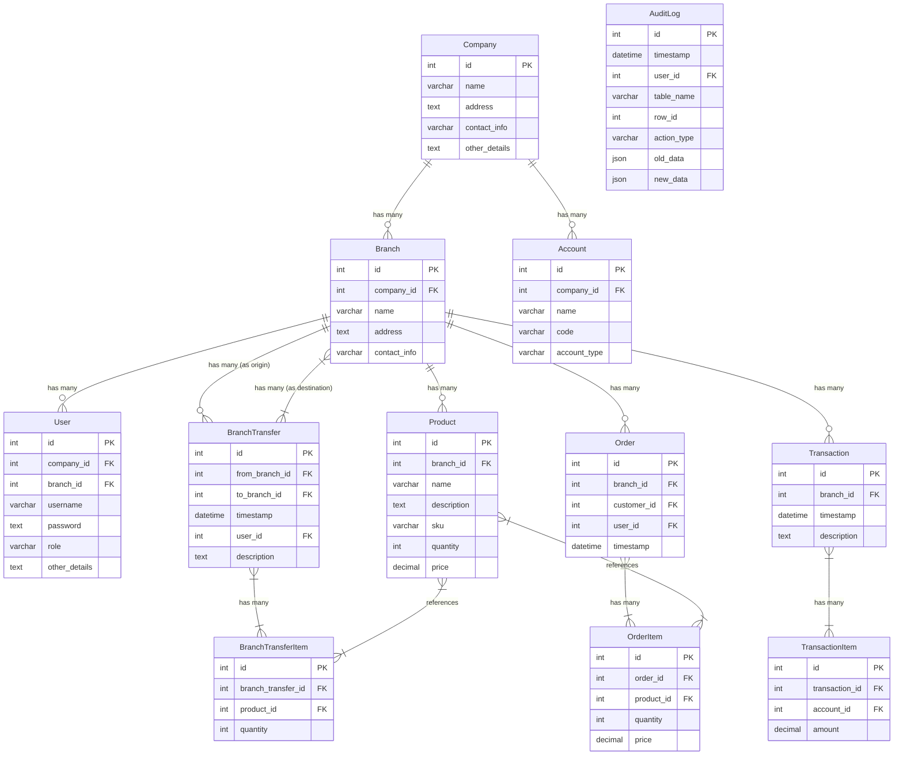

```mermaid
erDiagram
    Company {
        int id PK
        varchar name
        text address 
        varchar contact_info 
        text other_details 
    }

    Branch {
        int id PK
        int company_id FK 
        varchar name
        text address 
        varchar contact_info 
    }

    User {
        int id PK
        int company_id FK
        int branch_id FK
        varchar username 
        text password   
        varchar role   
        text other_details 
    }

    Product {
        int id PK
        int branch_id FK
        varchar name
        text description
        varchar sku
        int quantity 
        decimal price
    }

    Order {
        int id PK
        int branch_id FK
        int customer_id FK
        int user_id FK 
        datetime timestamp 
    }

    OrderItem {
        int id PK
        int order_id FK
        int product_id FK
        int quantity 
        decimal price
    }

    Account {
        int id PK
        int company_id FK
        varchar name
        varchar code
        varchar account_type 
    }

    Transaction {
        int id PK
        int branch_id FK
        datetime timestamp
        text description
    }

    TransactionItem {
        int id PK
        int transaction_id FK
        int account_id FK
        decimal amount 
    }

    BranchTransfer {
        int id PK
        int from_branch_id FK
        int to_branch_id FK
        datetime timestamp
        int user_id FK
        text description 
    } 

    BranchTransferItem {
        int id PK
        int branch_transfer_id FK
        int product_id FK
        int quantity 
    }

    AuditLog {
        int id PK
        datetime timestamp
        int user_id FK 
        varchar table_name
        int row_id 
        varchar action_type 
        json old_data 
        json new_data 
    } 

    Company ||--o{ Branch : "has many"
    Branch ||--o{ User : "has many"
    Branch ||--o{ Product : "has many" 
    Branch ||--o{ BranchTransfer : "has many (as origin)"
    Branch }|--|{ BranchTransfer: "has many (as destination)" 
    BranchTransfer }|--|{ BranchTransferItem:  "has many" 
    Product }|--|{ BranchTransferItem:  "references" 
    Branch ||--o{ Order : "has many"
    Order }|--|{ OrderItem : "has many"
    Product }|--|{ OrderItem : "references" 
    Branch ||--o{ Transaction : "has many"
    Transaction }|--|{ TransactionItem : "has many"
    Company ||--o{ Account : "has many" 
```